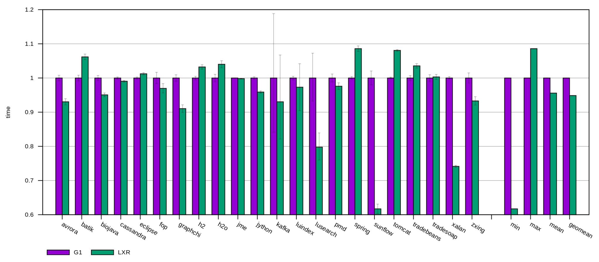
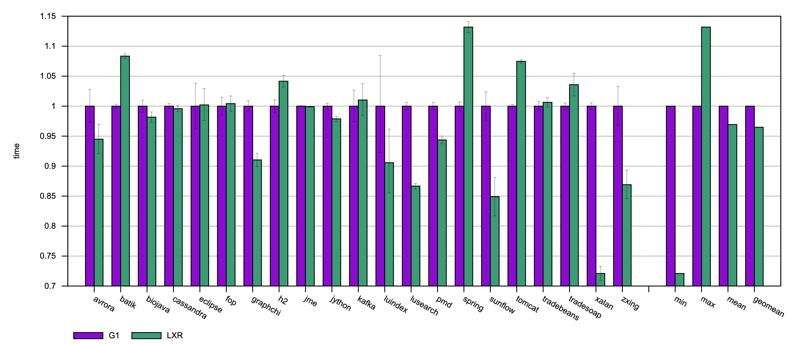
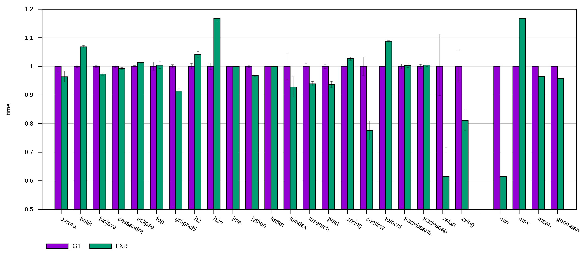
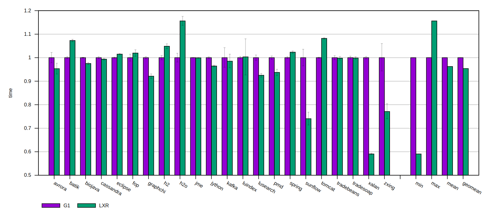
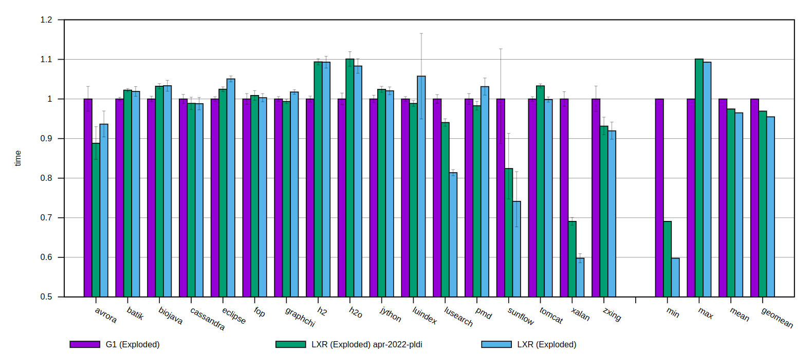

# [2023-Nov-28] core-597effa, binding-9869048

_Updated to dacapo-23.11-chopoin_

Plotty Log: [lxr-xput-regression-bear-2023-11-27-Mon-114500](http://squirrel.anu.edu.au/plotty-public/wenyuz/v8/p/AcJ3Dy)

# [2023-Oct-12] core-edfca0e, binding-8fa93eb

_Updated to mmtk v0.20.0_

Plotty Log: [lxr-xput-regression-boar-2023-10-12-Thu-053649](http://squirrel.anu.edu.au/plotty-public/wenyuz/v8/p/H43KgK)

# [2023-Aug-06] core-8228e5e, binding-e461a61

Plotty Log: [lxr-xput-regression-boar-2023-08-06-Sun-235839](http://squirrel.anu.edu.au/plotty-public/wenyuz/v8/p/t5YEmZ)

# [2023-Jul-18] core-ad9314e, binding-98eb6f9f

Plotty Log: [lxr-xput-regression-boar-2023-07-18-Tue-235530](http://squirrel.anu.edu.au/plotty-public/wenyuz/v8/p/wXY63U)

# [2023-Feb-08] core-22698ad, binding-0261366

Plotty Log: [lxr-xput-boar-2023-02-08-Wed-081345](http://squirrel.anu.edu.au/plotty-public/wenyuz/v8/p/vVqThG)