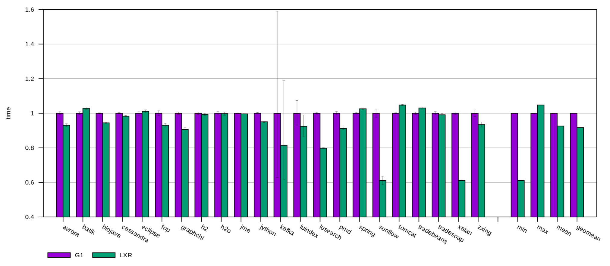

# [2023-Dec-13] core-4ab99bb, binding-cdbc8de

Plotty Log: [lxr-xput-regression-bear-2023-12-13-Wed-235836](http://squirrel.anu.edu.au/plotty-public/wenyuz/v8/p/CaGxpz)

LXR total time geomean: 0.917 (highest: tomcat=1.048, lowest: xalan,sunflow=0.611).

# [2023-Nov-28] core-597effa, binding-9869048

_Updated to dacapo-23.11-chopoin_

Plotty Log: [lxr-xput-regression-bear-2023-11-27-Mon-114500](http://squirrel.anu.edu.au/plotty-public/wenyuz/v8/p/AcJ3Dy)

LXR total time geomean: 0.949 (highest: spring=1.086, lowest: sunflow=0.617).

# [2023-Oct-12] core-edfca0e, binding-8fa93eb

_Updated to mmtk v0.20.0_

Plotty Log: [lxr-xput-regression-boar-2023-10-12-Thu-053649](http://squirrel.anu.edu.au/plotty-public/wenyuz/v8/p/H43KgK)

LXR total time geomean: 0.965 (highest: spring=1.132, lowest: xalan=0.721).

# [2023-Aug-06] core-8228e5e, binding-e461a61

Plotty Log: [lxr-xput-regression-boar-2023-08-06-Sun-235839](http://squirrel.anu.edu.au/plotty-public/wenyuz/v8/p/t5YEmZ)

LXR total time geomean: 0.958 (highest: h2o=1.168, lowest: xalan=0.615).

# [2023-Jul-18] core-ad9314e, binding-98eb6f9f

Plotty Log: [lxr-xput-regression-boar-2023-07-18-Tue-235530](http://squirrel.anu.edu.au/plotty-public/wenyuz/v8/p/wXY63U)

LXR total time geomean: 0.954 (highest: h2o=1.156, lowest: xalan=0.591).

# [2023-Feb-08] core-22698ad, binding-0261366

Plotty Log: [lxr-xput-boar-2023-02-08-Wed-081345](http://squirrel.anu.edu.au/plotty-public/wenyuz/v8/p/vVqThG)

LXR total time geomean: 0.955 (highest: h2o=1.093, lowest: xalan=0.598).

_Note: This run uses exploded builds._